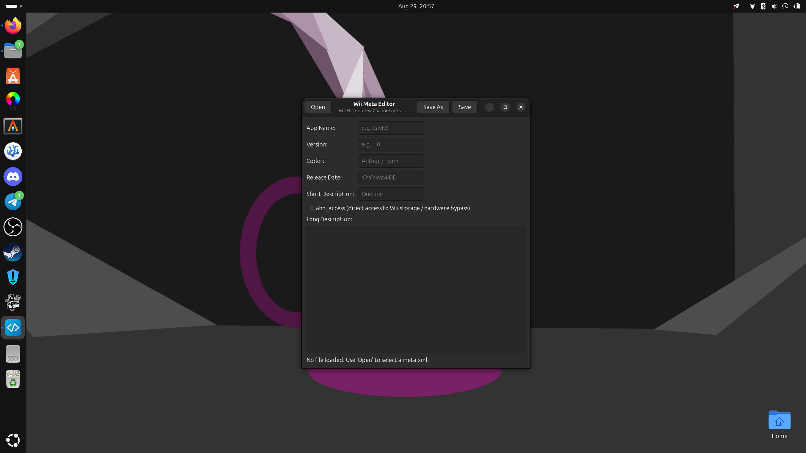

# Wii Meta Editor

A lightweight GTK3 editor for the `meta.xml` file of the **Wii Homebrew Channel**.

It lets you open a `meta.xml`, edit the important tags (name, version, release
date, coder, short/long description, `ahb_access`) and save it back as clean,
properly formatted XML.

## Features

- Open & edit Wii Homebrew Channel `meta.xml` files
- Edit: app name, version, coder, release date, short & long description,
  and the `ahb_access` flag
- Flexible date input: `YYYY-MM-DD`, `DD.MM.YYYY`, `DD.MM.YY` or the native
  Wii format `YYYYMMDDHHMMSS`
- Blank/new files are offered as an empty template so you can build a
  `meta.xml` from scratch
- Clean, formatted UTF-8 XML output
- Open a file directly from the file manager (opens via `argv[1]`)

## Screenshot



## Download

Prebuilt releases are available on the [Releases](https://github.com/lfisbeck650-cloud/wii-meta-editor/releases) page,
including a `.deb` package for Debian/Ubuntu.

### Install the .deb

```sh
sudo apt install ./wii-meta-editor_<version>_amd64.deb
```

This installs the binary, a desktop entry and an icon. Afterwards launch
**Wii Meta Editor** from your app menu, or run `wii-meta-editor`.

## Build from source

### Requirements (Debian/Ubuntu)

Install the build dependencies with:

```sh
sudo apt install git build-essential pkg-config libgtk-3-dev libxml2-dev
```

### 1. Clone & build

```sh
git clone https://github.com/lfisbeck650-cloud/wii-meta-editor.git
cd wii-meta-editor
make               # compiles the binary into ./wii-meta-editor
```

### 2. Install

```sh
sudo make install
```

`make install` installs:

- `/usr/local/bin/wii-meta-editor` (the binary)
- `/usr/local/share/applications/io.homebrew.WiiMetaEditor.desktop`
- `/usr/local/share/icons/hicolor/scalable/apps/io.homebrew.WiiMetaEditor.svg`

### 3. Run

```sh
wii-meta-editor                    # open the editor
wii-meta-editor path/to/meta.xml   # open a specific file
```

### Uninstall

```sh
sudo make uninstall
```

### Building a .deb yourself

To build a Debian package from source:

```sh
make deb          # produces wii-meta-editor_<version>_amd64.deb
```

The version is derived from the latest git tag; override it with `make deb
VERSION=1.2.3` if needed.

### Make targets

| Command              | Description                                            |
|----------------------|--------------------------------------------------------|
| `make` / `make all`  | Compile the binary from `src/`                         |
| `make install`       | Install binary, desktop entry and icon (root)          |
| `make uninstall`     | Remove installed files (root)                          |
| `make deb`           | Build a `.deb` package                                 |
| `make clean`         | Remove build artifacts and the binary                  |

## Project layout

```
.
├── Makefile          # build rules (outputs into build/)
├── build/            # compiler artifacts (*.o, *.d)
├── src/
│   ├── main.c        # entry point
│   ├── app.h         # shared structs & interfaces
│   ├── app.c         # controller: dialogs & file handling
│   ├── gui.c         # pure GTK GUI (form rendering)
│   └── meta.c        # pure XML logic (libxml2, date handling)
├── io.homebrew.WiiMetaEditor.desktop
├── io.homebrew.WiiMetaEditor.svg
├── debian/
│   └── control       # metadata for the .deb package
├── screenshots/
└── README.md
```

## Usage

Launch from the app menu, or open a file directly:

```sh
wii-meta-editor path/to/meta.xml
```

## Keyboard shortcuts

| Shortcut        | Action          |
|-----------------|-----------------|
| `Ctrl+O`        | Open            |
| `Ctrl+S`        | Save            |
| `Ctrl+Shift+S`  | Save As         |

## License

*Add the license of your choice here.*
